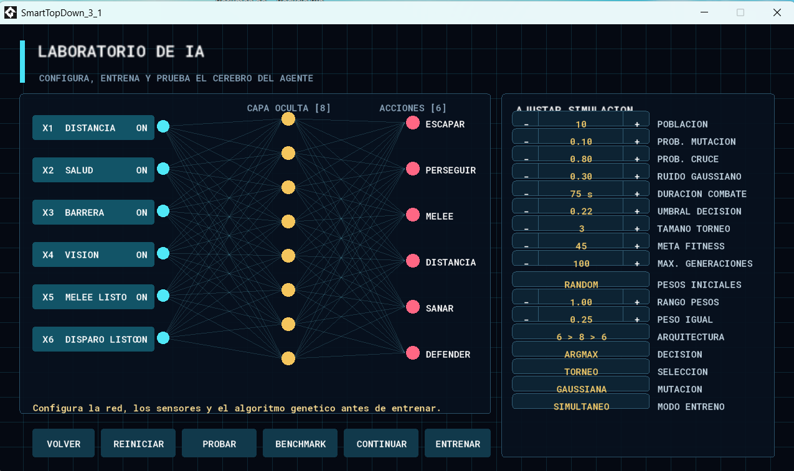
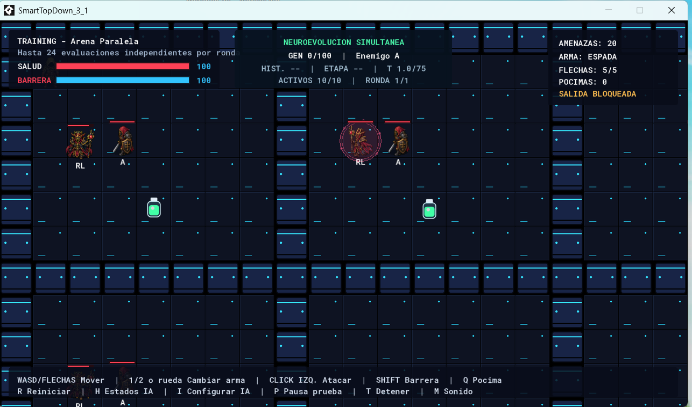
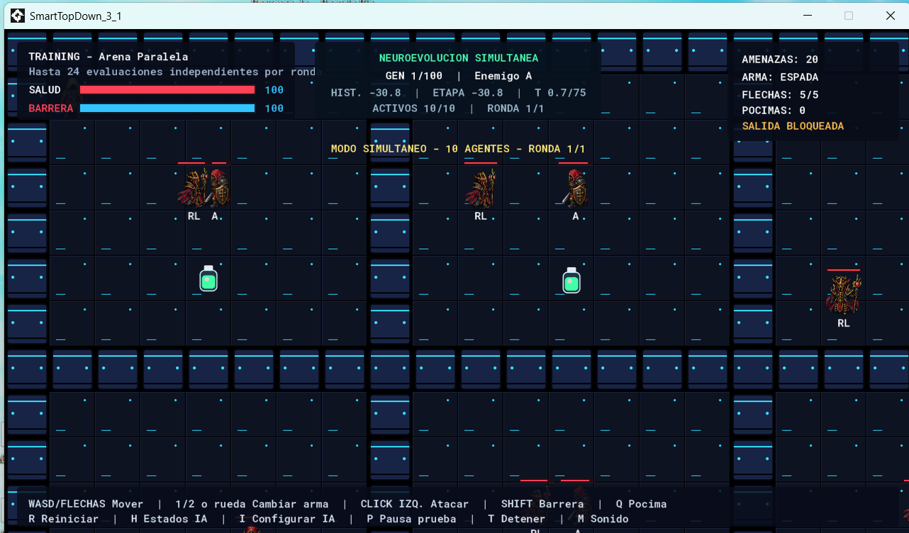
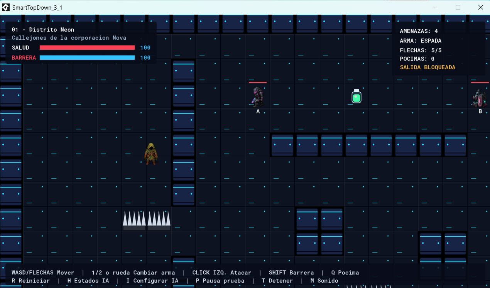

# SmartTopDown

<p align="center">
  <b>Top-down combat AI laboratory combining game AI, neural networks, genetic algorithms and reproducible benchmarking.</b>
</p>

<p align="center">
  
  
  
  
</p>

---

## Overview

**SmartTopDown** is a complete top-down combat game and AI experimentation environment built in **GameMaker**.

It combines:

- Human-controlled combat
- Rule-based enemy behaviors
- Multiple maps
- Obstacles, healing and ranged combat
- Neural-network-controlled agents
- Genetic-algorithm training
- Parallel population evaluation
- Saved best agents and checkpoints
- A reproducible 10-scenario benchmark

The project was designed not only to train an agent, but also to compare how different evolutionary configurations behave outside the training environment.

---

## Screenshots

<p align="center">
  
</p>

<p align="center">
  
</p>

<p align="center">
  
</p>

<p align="center">
  
</p>

---

## Core Gameplay

The game supports:

```text
Movement
Melee attacks
Ranged attacks
Shield / defense
Healing potions
Enemy encounters
Environmental hazards
Multiple maps
```

The player can switch weapons, attack, defend and use healing items while navigating the level.

---

## AI Agent

The learned combat agent uses a feed-forward neural network.

Default architecture:

```text
6 inputs
   │
   ▼
8 hidden neurons
   │
   ▼
6 outputs
```

The project also supports a shallow architecture without the hidden layer for comparison.

### Inputs

The six sensors shown by the AI laboratory represent:

```text
X1  Distance
X2  Health
X3  Barrier / shield
X4  Vision
X5  Melee ready
X6  Ranged attack ready
```

Each input can be enabled or disabled from the configuration interface.

### Outputs

The six neural outputs represent the complete combat decision space:

```text
ESCAPE
CHASE
MELEE
RANGED
HEAL
DEFEND
```

The output layer is normalized with softmax.

The default action-selection mode is **ARGMAX**, with threshold-based decision support also available.

---

## Neural Chromosome

For the hidden-layer architecture, the active chromosome contains:

```text
Input → Hidden        6 × 8 = 48
Hidden biases                 8
Hidden → Output       8 × 6 = 48
Output biases                  6
--------------------------------
Total                         110
```

These 110 parameters are the genome optimized by the genetic algorithm.

---

## Genetic Algorithm

Default evolutionary configuration:

```text
Population:             10
Max generations:       100
Mutation rate:        0.10
Crossover rate:       0.80
Selection rate:       0.50
Tournament size:         3
Mutation method:   Gaussian
Gaussian sigma:       0.30
Initial weights:     Random
Weight range:         1.00
Equal-weight value:   0.25
Decision mode:      ARGMAX
Decision threshold:   0.22
Random seed:          1337
Training mode:    Parallel
```

The AI laboratory exposes these parameters directly so configurations can be tested without modifying the source code.

---

## Evolution Features

The training system includes:

- Tournament selection
- Roulette selection
- Gaussian mutation
- Uniform mutation
- Configurable crossover
- Random / zero / equal weight initialization
- Hidden-layer or shallow architecture
- Sensor toggles
- ARGMAX or threshold decisions
- Reproducible random seed
- Saved best chromosome
- Training checkpoint
- CSV training logs
- Parallel agent evaluation

---

## Training Curriculum

The evolution manager contains four training stages:

```text
Stage 1  Enemy A
Stage 2  Enemy B
Stage 3  Enemy C
Stage 4  Human player
```

Agents are evaluated in combat and fitness is updated according to their behavior and episode result.

The training manager tracks values such as:

- Winner
- Lifespan
- Damage dealt
- Damage taken
- DPS
- Kills
- Dodges
- Success rate
- Fitness
- Training configuration

---

## Parallel Training

The dedicated training arena evaluates multiple agents simultaneously.

This allows the project to run population-based neuroevolution more efficiently while keeping each combat evaluation independent.

Training information displayed in-game includes:

```text
Generation
Current stage
Active agents
Round
Fitness history
Simulation state
```

---

## Saved AI and Checkpoints

The project persists evolution data using:

```text
smarttopdown_best_ai.json
smarttopdown_training_checkpoint.json
smarttopdown_training_results.csv
```

The saved best-agent payload contains the architecture, chromosome, fitness, generation, enabled sensors, decision mode and training configuration.

---

## Benchmark System

SmartTopDown includes a reproducible benchmark with **10 scenarios**:

| # | Scenario |
|---|---|
| 1 | 1 Enemy A vs 1 agent |
| 2 | 1 Enemy B vs 1 agent |
| 3 | 1 Enemy C vs 1 agent |
| 4 | Human vs 1 agent |
| 5 | 3 Enemy A vs 1 agent |
| 6 | 3 Enemy B vs 1 agent |
| 7 | 3 Enemy C vs 1 agent |
| 8 | 6 mixed A/B/C vs 1 agent |
| 9 | 6 mixed A/B/C vs 3 agents |
| 10 | Human vs 3 agents |

Default benchmark configuration:

```text
Repetitions per scenario: 20
Episode timeout:          60 s
Seed:                     1337
```

The benchmark freezes the selected trained chromosome and evaluates it under repeatable conditions.

---

## Benchmark Metrics

The CSV benchmark output records information including:

```text
Scenario
Repetition
Episode seed
Winner
Episode time
Average lifespan
Damage dealt / taken
DPS
Kills
Target count
Success rate
Agent / opponent counts
Deaths
Potions used
Time spent on each action
Dominant action
Training configuration
Network architecture
Decision mode
Sensors
Training seed
```

Generated benchmark files:

```text
smarttopdown_benchmark_results.csv
smarttopdown_benchmark_summary.csv
```

---

## Levels

The source includes multiple game and AI environments, including:

```text
01 - Distrito Neon
02 - Laboratorio Cobalto
03 - Fortaleza Carmesí
TRAINING - Escenario 1
TRAINING - Arena Paralela
BENCHMARK - Arena Sigma
```

---

## Project Structure

```text
SmartTopDown/
├── datafiles/
│   ├── audio/
│   └── textures/
├── objects/
│   └── obj_game/
├── rooms/
│   └── rm_game/
├── scripts/
│   ├── scr_ai_core/
│   ├── scr_core/
│   ├── scr_evolution_manager/
│   ├── scr_ga/
│   ├── scr_levels/
│   └── scr_nn/
├── tools/
│   └── validate_benchmark.py
├── screenshots/
├── SmartTopDown_3_1.yyp
└── README.md
```

---

## Controls

The in-game interface exposes controls such as:

```text
WASD / Arrows    Move
1 / 2 / Mouse    Change weapon
Left Click       Attack
SHIFT            Shield
Q                Potion
R                Restart
H                AI states
I                Configure AI
P                Pause test
T                Stop
M                Sound
```

---

## Running the Project

### Requirements

- GameMaker / GameMaker Studio compatible with the included `.yyp` file

### Steps

1. Clone or download the repository.
2. Open `SmartTopDown_3_1.yyp`.
3. Run the project.
4. Play the normal levels or open the AI laboratory.
5. Configure the network and genetic algorithm.
6. Start neuroevolution training.
7. Save / test the best evolved agent.
8. Run the benchmark to evaluate generalization.

---

## Tech Stack

```text
GameMaker
GML
Game AI
Neural Networks
Genetic Algorithms
Neuroevolution
Parallel simulation
CSV / JSON persistence
Python benchmark validation utility
```

---

## Main Idea

SmartTopDown is not only a combat game.

It is an environment for studying the difference between:

```text
training performance
        and
generalization performance
```

The project makes it possible to evolve combat policies, preserve them, replay them and evaluate them systematically across reproducible scenarios.
